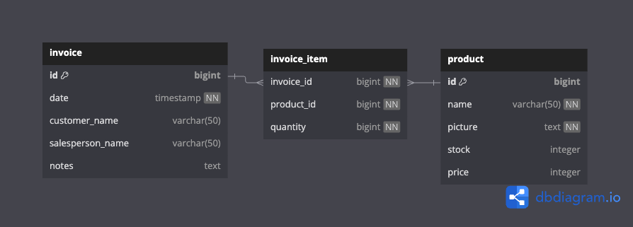

# Full Stack Engineer - Technical Challenge

## Table of contents

- [Overview](#overview)
- [Tech and Tools used](#tech-and-tools-used)
- [Folder Structure](#folder-structure)
- [Quick Explanation](#quick-explanation)
- [Challenges](#challenges)
- [Limitations](#limitations)
- [Improvements](#improvements)
- [gallery](#gallery)
- [How to Start](#how-to-start)


## Overview

### Tech and Tools used
Frontend:
- Typescript
- React.js
- React Router
- Redux + Redux Toolkit
- Tailwind CSS
- shadcn
- react-hook-form
- zod
- axios

Backend:
- Typescript
- Node.js 
- Express
- PSQL (Database)
- Drizzle (ORM)
- TSX

### Folder Structure
Frontend:
- `/src`
  - `/api` Functions for API calls.
  - `/app` Redux setup and slices lives here.
  - `/components` React components files.
  - `/lib` Contains files with 3rd party library specific code.
  - `/pages` React pages. Each page is represented in each folder easy for co-locations
  - `/utils` Utility files such as helpers, display, formatting.

Backend:
- `/src`
  - `/controllers`. Routes Handler/controller lives here
  - `/db`. Files related to ORM setup, schema, scripts live here
  - `/helpers`. Similar to Utils
  - `/routes`. Routes setup/configuration for each domains/feature

### Quick Explanation
On the backend, I implemented MVC architecture. At first, I wanted to implement Clean Architecture, but I thought it was too granular and tedious for current situation with time constraints.

Before starting the backend. I've planned out the ERD first and go through a couple iterations until the current version. Initially, I tried to built with proper table relations by normalizing it through a couple stages. In the end, I decided to keep it simple because we don't have many data requirements to work with.
 


On the frontend, I implemented simple React + React Router SPA since I only built 1 page. Using Next.js would be overkill for current use case. For Redux, I use the recommended approach of using Redux Toolkit (Slice, Thunk). 

For styling, the combo of Shadcn with Tailwind helped me tremendously boost my efficiency while building the UI by providing building blocks. It helped to cover the Web Accessibilty implementation too. However, I don't add much flair such as custom colors for the UI as it's out of the current requirements.

### Challenges
Backend
- I tried to use new technology, **Drizzle** as the ORM. Its approach of building queries and schema is very different from Prisma, which doesn't requires Foreign key to create relations between tables. After playing around with it, it was quite intuitive and similar to Native SQL with extra type-safety layer on top. However, there's still some quirks since it's still in v0.7.x by this time.
- Querying for the periodical/interval data was quite tricky. I'm able to solve it with Drizzle's **sql** function to write SQL.

Frontend
- Deciding the decent data structure for Time Series Graph was really difficult. Especially with the different period/interval it must be uniform across periods so they are compatible with the chart component. I decided to transformed it in the client by creating a base chart data (compatible with the Chart Component) that will be pushed with appropiate values from API.
-  Initially I was trying to implement the auto-suggest component by my own. Although it was working, it's really hard to worked with and not accessible at all. In the end, I decided to implement it with Shadcn which worked great and beautifully.
- For the add products feature, it's really interesting to implement a field with multiple data item that can be added and removed anytime, it will take a lot of time. Thankfully, `react-hook-form` have a useful hook `useFieldArray` which handles dynamic array data with object.

### Limitations
- On the frontend, the chart can only display data with no extra capabilities such as pan and zoom. While researching for the features, there's not a lot of resources that talk about how to implement the feature. It also requires a lot of calculations and planning. So, I decided not to implement it given the current time constraint.
- For the product, it can add the same product multiple times. However, it still stored correctly in the database

### Improvements
- The Data structure for Charts can still be improved for easier handling. It can maybe be done from backend in the sql query or Frontend with the transformations.
- Data fetching should be done with wrapper like `tanstack-query` or `rtk-query` that provides caching layer. Especially, for dashboard applications the granular caching control can helps when dealing with large amount of data. It can definitely improve load and reduce call to the server.
- Input for salesperson should be pre-defined selection with select since there can't be random person be the sales.
- Implement stocks checking on the input and display total price of added products

### Gallery 


### How to Start

#### System Requirements
- Node.js >= 16.0.0
- Docker Postgres Image or Local Postgres database.
- npm >= 7.0.0

Fork and clone the repo, then go into the directory:

```bash
cd widatech-invoice-challenge
```

#### Backend
Spin up the REST API so Frontend can use the data. Open the backend directory
```bash
cd backend

# Copy to local .env, you will need to configure some variables
cp .env.example .env

# Install dependencies
npm install
```
Make sure to configure the Environment Variables

Make sure you have your DATABASE_URL setup properly and the actual Database is up and running, then follow these steps:

```bash
# To push schema changes you made in drizzle
npm db:push

# This will reset your database and re-seed it with data in src/db/seed.ts.
npm db:seed

# Start the development server
npm run dev
```

#### Frontend
After the Backend is ready, now we can start the Frontend.

Open a new terminal tab/window then to the root directory of this project, then
```bash
cd frontend

# Install dependencies
npm install
```

After installation is done, start the dev server

```bash
# Start the development server
npm run dev
```

The application should be served at http://localhost:5173

